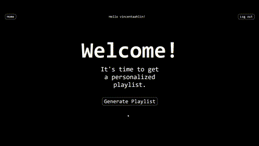

# React + TypeScript + Spotify API

This is a playlist generator that uses the Spotify API that gets saved tracks and generate a tailored playlist.

## Gaining Access

If you are interested in using this app you'll need to contact me to get on the development list. Contact via vincent.ahlin99@gmail.com send full name and the mail connected to your spotify.

The app is currently in development and features like being able to select a mood is coming.

## Want to run on your own?

> To install use "npm i"

- Create a app on spotify developer site and get the client id as well as setting a Redirect URI.

The Redirect URI will under development be the dev server

- Create a .env file in the root of the project. Use this template:

  > VITE_SPOTIFY_CLIENT_ID="YOUR_CLIENT_ID"
  > VITE_REDIRECT_TARGET="http://localhost:\*\*\*\*/"
